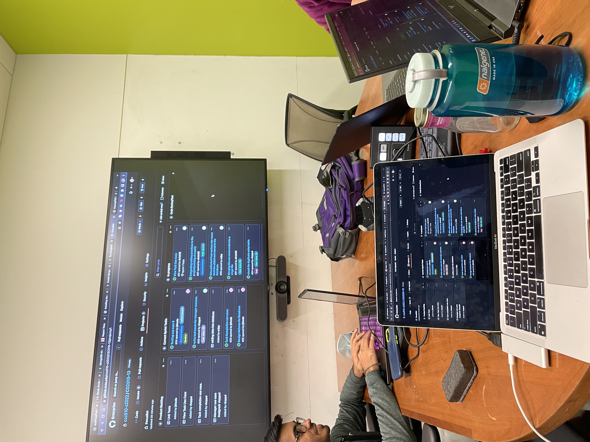
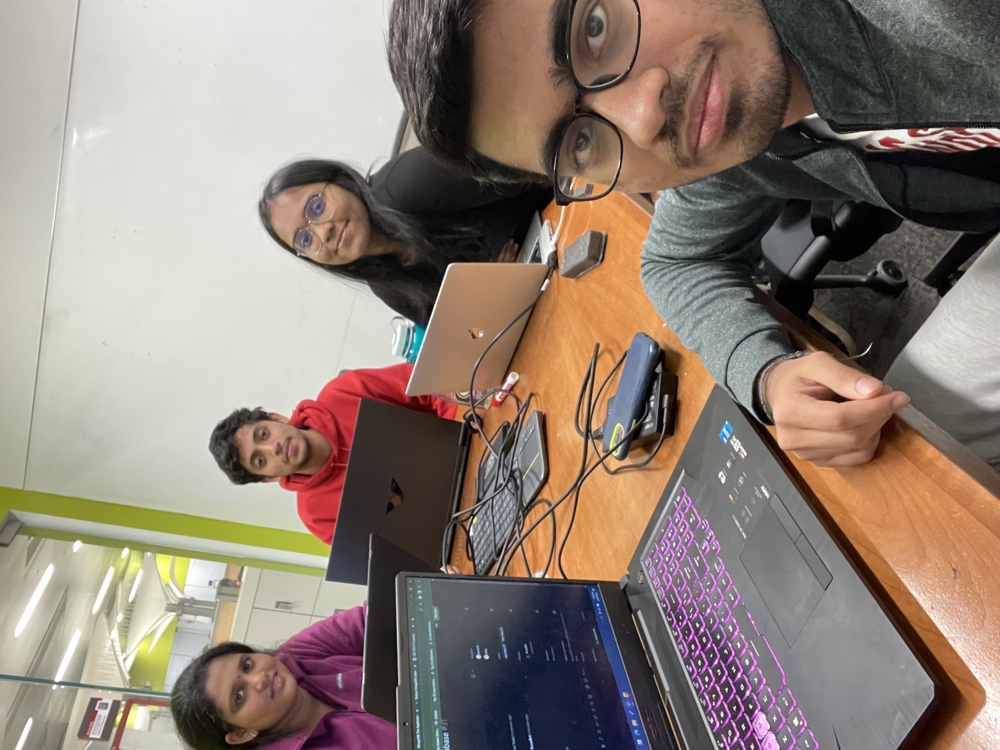

# Iteration worksheet for sprint 1

Deliverable | Item/Status | Issues/Tasks
--- | --- | --- |
Use Case | Get Meeting Availability | Planned to meet every day to discuss progress. Plan meetings according to every member's availability
Integration of use cases implementation code | In Progress | Two developers worked on parts of this code and intergration is to be done. #27 
Creation and Connection of MongoDB | Completed | #26
'Assign Task' Use case integration with database| Completed | #18, #19, #20
'View Task' Use case integration with database | In Progress | #21
'Completed Task' Use case integration with database| In Progreess | #23
Unit Test | Test in Sprint 2 | Currently in Backlog

# Iteration worksheet for sprint 2
Deliverable | Item/Status | Issues/Tasks
--- | --- | --- |
Use Case | Get Meeting Availability | Planned to meet every day and update everyone with progress. Distribute tasks among the team members.
Integration of use cases implementation code | Completed | Two developers worked on parts of this code and intergration is to be done. #27
Create Iteration worksheet for sprint 2 | Completed | #39
'View Task' Use case integration with database | Completed | #21
'Completed Task' Use case integration with database| Completed | #23
Integrating collory practices in the project | Completed | #37 , researching and implementing the practices
Check for duplicate entry tasks | Completed | #34
Testing use case 2 | In Progress | #35, implementation in progress
Testing use case 3 | In Progress | #33, implementation in progress
Review | Get Meeting availability for final review before demo | Practice demo 

# Iteration worksheet for Deployment
Deliverable | Item/Status | Issues/Tasks
--- | --- | --- |
Use Case | Get Meeting Availability | Planned to meet every day and update everyone with progress. Distribute tasks among the team members.
Make user name case insensitive | In Progress | #54
View task usecase | In Progress | If user is not in the database, return a message prompting the same. Currently it's returning an empty list
View task usecase | In Progress | #46
Documentation  DEPLOY.md | In Progress | #48, #51
Iteration worksheet | Completed | #53
Testing all use cases and end cases | In Progress | #49
Fixing all issues in Process.md Feedback | In Progress | #55, #56

# Sprints and Deploy Stage Meeting Minutes
As a part of the sprint process, we have been meeting to discuss the pending items for the completion of the bot, assignment of tasks and next-steps. The minutes for our sprint meetings can be found [here](MinutesOfMeeting.md)

# Core Practice
One core practice (XP Practice) that was not already a part of our software process was Pair Programming. Pair Programming has two programmers working on the same system. One programmer considers the big picture and searches for ways to better or rearrange code. The other programmer takes the lead and focuses on developing clean, compilable, and runnable code. This practice will result in fewer coding mistakes because your coding partner would look into your code simultaneously. We have also found this to be an effective way to share knowledge.  

In our sprints, we integrated this practice in our development by having two developers work on a use case together along with texting it. This ensures increased speed and efficiency in completing the task. Since the roles can be switched during the process, it helped everyone get familiar with all the aspects of the development task. 

# Corollary Practice
One corollary practice that we implemented a lot in this project is "Shared Code". This practice basically means any team member can contribute to any code at any time. This helped develop a sense of shared responsibility in all the teammmates. This practice will lead to the quality not deteriorating because a single memeber is not responsibile for a task, but others can join in and contribute at their will. 

In our project, we implemented this practice by helping eachother with fixing bugs in the code and testing end cases. As a result, this has helped us to enhance our codes and thus create collective responsibility. 

# Here are some pictures that we took during our meetings:

# Project board for Sprint 1 

# Project board for Sprint 2

