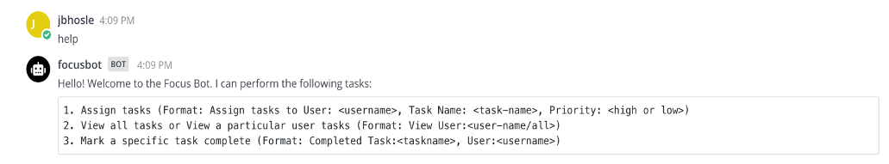
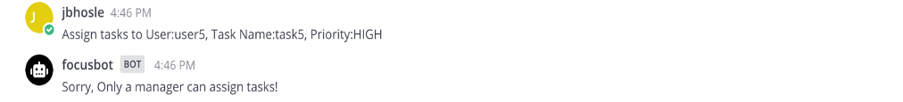
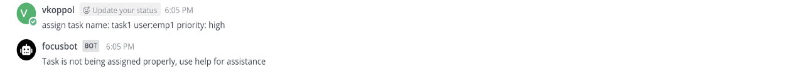
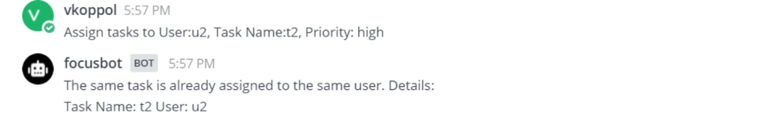
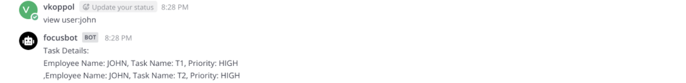
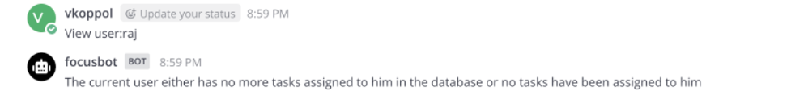

# Project Report

## Problem Statement:
Tasks are split among the members of a team that is responsible for building software or maintaining existing software. Multiple tasks are distributed among team members; yet, some tasks may be ignored or misunderstood by team members. A team needs a centralized system to help them excel their productivity and keep up with their teammates progress with tasks. 

Focusbot is a bot which will solve all these problems and help any team succeed at their tasks by prioritizing their everyday duties. The manager of the team can assign tasks to the employees with designated priorities. 

### Tagline: Watch me work!

## Primary features and screenshots:

### Mocking Service Component:
To mock services, we used a mock MariaDB database. It acts as a dummy database for the Bot to use. We've constructed a database function that pulls user, task, and priority values from Mattermost. We were able to obtain the code necessary to update the user's tasks and priorities in a database that can be retrieved and changed.

### Mattermost server:
We have used the Mattermost chat server for this project. 

### Help feature:
The commands in our bot were created in a specific format, and the bot can only understand them if they are delivered in that format. To help users, we've built a little tutorial to help them follow the commands. By typing the “help” command in Mattermost, it will give you the structure of the command and the keywords you'll need to run it.

### Use cases overview:
The bot supports 3 main use cases which are:
1.	Manager assigns tasks
Firstly, when the manager assigns the task, the bot GETS the string entered and looks for keywords. Here the keywords are 'assign', 'user', 'Task Name', 'Priority'. It is essential that the manager uses these keywords so that the bot can collect the data. When the manager assigns the task, it will be displayed to the manager.

2.	Employees views task assigned
When the employee needs to know about his tasks, he can go to his Mattermost home and enter his/her name and the keyword 'view', The bot then replies him informing about his tasks with priority for each.

3.	Updates on task progress
The employee has to enter the keywords 'completed' followed by the name of the task. The task will then get removed from the list of tasks that is assigned. Additionally, the updated task is displayed. 

The bot GETS the string entered in Mattermost and parses it. In case of the manager, if the keywords match, it will store the information about the tasks and priority in the class. Multiple tasks and priority for each is stored in an array of strings. Then if an employee wants to view their tasks, the sting that they entered will be parsed and the information is posted back in Mattermost.

### Assigning tasks:
When the manager assigns tasks to the bot, the command should contain the keywords Assign , User Name, Task Name and Priority in order. Even if one item is not present in the command, then it doesnt get executed and the manager needs to run the command again. If the command is successful, the bot will display the task assigned to the user,

Note: The task assignment command follows a particular order. If this is not followed, the bot is going to throw an error.

#### Feature 1: Only Manager can assign tasks, if any other user tries to assign tasks the bot throws an error like this:

#### Feature 2: When the Manager assigns the task in the correct format, the task gets successfully assigned:

#### Feature 3: If the task is not assigned in the correct format (for example: user, task and priority separated by commas) the bot gives an error and prompts to use the help feature.

#### Feature 4: If a user tries to assign a task that has already been assigned, the bot prints a notification stating that the task has already been assigned. Because this method relies on matching task names to existing tasks, be cautious when entering task names.

### Viewing tasks:
In order to view tasks (considering viewing all tasks and user specific tasks), we have to mention "User:" in order for successful execution. If we don’t give the data in that particular format, an error is printed.

#### Feature 1: The input for viewing tasks should be in the correct format as provided in the help feature.

#### Feature 2: If there are no prior tasks assigned to the user then we get an output indicating that there ae no tasks assigned to that user. 

### Notifying the bot after completing a task

#### Feature 1: For notifying the bot of task completion, we need to mention the task name and the user that has completed the task along with "Completed" keyword. In case they are not mentioned, the task still remains assigned to that person.

#### Feature 2: In case the task has not been assigned previously, then we get the output messages shown below. 

#### Feature 3: When the task exists and the command gets executed, the message display the task details that has been completed. This output message is used as verification for executing the command.

## Our reflection on the development process and project:

This entire process has been a learning curve with many obstacles. We have developed teamwork, communication, and responsibility throught the duration of this project. As difficult as the process seemed in the start, it all seems worth the effort in the end. 

In our sprints, we integrated the core practice of 'Pair Programming' in our development by having two developers work on a use case together along with texting it. This ensures increased speed and efficiency in completing the task. Since the roles can be switched during the process, it helped everyone get familiar with all the aspects of the development task. 

During the code sprints and bot milestone, we assigned issues in a uniform manner and updated the issue on the github board regularly. This helped us keep track of the tasks to be completed and also provide assistance to teammates when required. We organised scrum meeting as often as we could and discussed often about the bot. In the github repository, each one of us created a separate branch on which we were supposed to work and then finally merged them into a single branch. This helped us by ensuring that there is a backup in case one of the team members induces bugs in the project. 

One corollary practice that we implemented a lot in this project is "Shared Code". This practice basically means any team member can contribute to any code at any time. This helped develop a sense of shared responsibility in all the teammmates. This practice will lead to the quality not deteriorating because a single memeber is not responsibile for a task, but others can join in and contribute at their will. 

Documenting the process throught the project helped us keep track of our tasks in a timely manner. Projects boards were very helpful for this. 

Additionally, this project gave us a sense of software engineering that we would experience in our jobs.

## Any limitations and future work: 

We plan to include a pomodoro timer which can further improve the user's productivity and help them focus better. 

Limitations:
Our bot follows instructions as per the `help` feature. If commands in any other format are inserted, the bot promts and error. This can be improved by adding additional keywords which will make the bot work for more similar commands.

Project Presentation link is provided [here](https://drive.google.com/file/d/10y5cTUb4lgvJAYp1FmR2muq438iuZxud/view?usp=sharing)
